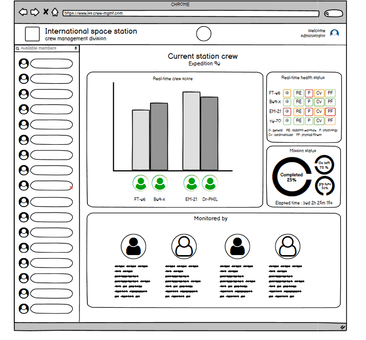

# **Mise en forme du site**
> wireframe des pages

---
## **Description**
 le wireframe est un outil qui apporte beaucoup d’avantages. Surtout lors de la refonte ou de la création d’un site web. La maquette fonctionnelle est un schéma qui montre l’agencement des parties composant une page web. Elle permet donc la visualisation des zones de texte, l’emplacement des images, des vidéos, des liens, ainsi que des différents éléments graphiques.

#### Technologie
- Balsamiq

---

##  **Les interfaces**

### **Page Accueil**

 la page principale du site web contient
 - Barre de navigation 
    - logo 
    - Icon de l'expédition spatiale actuelle
    - Administrateur
 - Corps 
   - Current station crew
      - Real-time crew score
      - Real-time health status 
      - Mission status
      - Monitored by ..
    - Liste des astronautes

   #### Page

---
### **On Hover**

        On fait défiler la liste et les informations réduites de l'astronaute apparaissent .

  #### Page

---

### **On click**
- On cliquant sur le nom de l'astronaute toutes ses informations apparaîtra
  - Technical skills 
  - Successfully completed tasks 
  - Personality traits
  - Favorite constellation 
  - Full report 
  - Recommended by 
  - Recommended teammates 
  - Next expedition crew

---
#### Page

---

### **On Add**

Restant dans la même page  
on cliquant sur le "code-name" du l'astronaute dans "next expedition crew" icône que nous voulons ajouter,
un message apparaîtra confirmant l'ajout .

---
 
 #### Page

---

### **on delete**
Restant dans la même page  
on cliquant sur le "code-name" du l'astronaute dans "next expedition crew" icône que nous voulons supprimer,
un message apparaîtra confirmant la suppression .

---
 
 #### Page

---

### **on modify**

Restant dans la même page,
On cliquantt sur l'icône d'édition 
    l'affichage des données totals 

 aprés cette procédure on le choix de valider la modification du coup l'affichage d'un message "modification validée"
   ou l'annulation .

---
  #### Page

 

---
